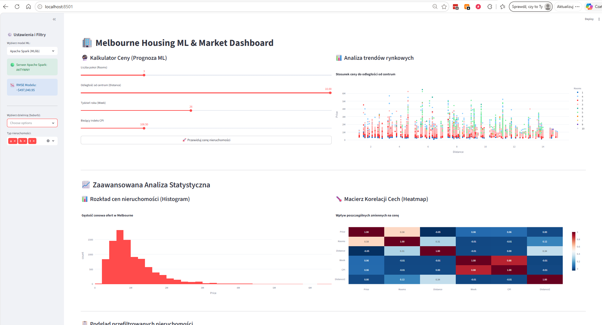

# 🏢 Melbourne Housing ML & Market Dashboard

Interaktywny dashboard analityczno-predykcyjny zbudowany w oparciu o bibliotekę **Streamlit** oraz model Machine Learning (Regresja) do szacowania wartości nieruchomości w Melbourne. Projekt został zaimplementowany obiektowo (zgodnie z zasadami czystego kodu) i zawiera zaawansowane filtrowanie oraz interaktywne wykresy rynkowe.

---

## 📊 Funkcje aplikacji
* **Kalkulator Ceny (ML Predykcja):** Prognozowanie wartości domu w czasie rzeczywistym na podstawie cech takich jak liczba pokoi, odległość od centrum, wskaźniki ekonomiczne (CPI, inflacja) oraz czas sprzedaży.
* **Interaktywny Wykres Trendów:** Dynamiczna wizualizacja zależności ceny od odległości z uwzględnieniem liczby pokoi (wykorzystująca bibliotekę Plotly).
* **Zaawansowane Filtrowanie:** Możliwość selekcji danych po dzielnicach (`Suburb`) oraz typie zabudowy (`Type`) bezpośrednio z panelu bocznego.
* **Wydajność (Caching):** Wykorzystanie mechanizmów pamięci podręcznej Streamlit (`@st.cache_resource`) do błyskawicznego ładowania bazy danych i wag modelu.

---

## 📁 Struktura Projektu
```text
DataScience/
│
├── app/
│   └── streamlit_app.py      # Główny kod aplikacji webowej (Klasa MelbourneHousingApp)
│
├── data/
│   └── Melbourne_housing.csv # Oczyszczona baza danych nieruchomości
│
└── models/
    └── melbourne_model.pkl   # Zapisany, wytrenowany model Machine Learning (Joblib)
```

---

# Screenshots

## TensorBoard



## 🛠️ Instrukcja uruchomienia lokalnego

Wykonaj poniższe kroki w terminalu swojego środowiska (np. PyCharm Terminal), aby uruchomić projekt na własnym komputerze.

### 1. Pobranie i przygotowanie projektu
Upewnij się, że znajdujesz się w głównym katalogu projektu:
```bash
cd C:\Users\Asus\PycharmProjects\DataScience
```

### 2. Instalacja wymaganych bibliotek
Zainstaluj pakiety niezbędne do uruchomienia interfejsu oraz obsługi danych i wykresów:
```bash
pip install streamlit pandas joblib plotly scikit-learn
```

### 3. Uruchomienie serwera Streamlit
Przejdź do folderu `app/` i uruchom dedykowany serwer aplikacji:
```bash
cd app
streamlit run streamlit_app.py
```
*Po wpisaniu tej komendy aplikacja automatycznie otworzy się w Twojej przeglądarce pod adresem `http://localhost:8501`.*

---

## 🚀 Instrukcja dla deweloperów (Git Workflow)

Poniżej znajduje się ściągawka z komend Gita użytych do synchronizacji repozytorium lokalnego z serwerem GitHub.

### Pierwsza konfiguracja i wymuszenie synchronizacji (w przypadku braku spójności historii):
```bash
# Pobranie zmian ze zdalnego repozytorium zezwalając na niepowiązane historie
git pull origin master --allow-unrelated-histories

# Wymuszenie wypchnięcia (Overriding zdalnego mastera wersją lokalną)
git push origin master --force
```

### Codzienna praca z projektem (Zapisywanie stabilnych wersji):
```bash
# 1. Sprawdzenie statusu zmodyfikowanych plików
git status

# 2. Dodanie wszystkich zmian do poczekalni (Staging area)
git add .

# 3. Zatwierdzenie zmian czytelnym komunikatem
git commit -m "Add production-ready Melbourne Housing ML Dashboard with Plotly and dynamic filters"

# 4. Wypchnięcie kodu na GitHub
git push origin master
```
### 🐳 Zarządzanie aplikacją przez Docker

Poniżej znajduje się kompletna sekwencja komend używanych do budowania, uruchamiania i czyszczenia środowiska kontenerowego:

```bash
# 1. Budowanie obrazu kontenera (na podstawie Dockerfile)
docker build -t melbourne-housing-ml .

# 2. Uruchomienie kontenera z przekierowaniem portu na lokalną maszynę
docker run -p 8501:8501 melbourne-housing-ml

# 3. Podgląd aktualnie uruchomionych kontenerów i ich identyfikatorów (Container ID)
docker ps

# 4. Zatrzymanie działającego kontenera (zamiast skrótu Ctrl+C)
docker stop <CONTAINER_ID>

# 5. Usunięcie nieużywanych, wiszących warstw i obrazów w celu zwolnienia miejsca na dysku
docker system prune -f
```

### 📡 Testowanie architektury strumieniowej (Apache Kafka & TensorFlow Live)

Projekt umożliwia symulację przetwarzania danych w czasie rzeczywistym. Aby uruchomić potok streamingowy:

1. **Uruchom lokalny serwer Apache Kafka:**
   ```bash
   docker run -d --name kafka-server -p 9092:9092 -e KAFKA_NODE_ID=1 -e KAFKA_PROCESS_ROLES=broker,controller -e KAFKA_LISTENERS=PLAINTEXT://0.0.0.0:9092,CONTROLLER://0.0.0.0:9093 -e KAFKA_ADVERTISED_LISTENERS=PLAINTEXT://localhost:9092 -e KAFKA_CONTROLLER_LISTENER_NAMES=CONTROLLER -e KAFKA_LISTENER_SECURITY_PROTOCOL_MAP=CONTROLLER:PLAINTEXT,PLAINTEXT:PLAINTEXT -e KAFKA_CONTROLLER_QUORUM_VOTERS=1@localhost:9093 -e KAFKA_OFFSETS_TOPIC_REPLICATION_FACTOR=1 apache/kafka:latest
   ```

2. **W osobnym terminalu uruchom Konsumenta (Silnik Predykcji Deep Learning):**
   ```bash
   cd src
   python kafka_consumer_dl.py
   ```

3. **W kolejnym terminalu uruchom Producenta (Generator Strumienia Ofert):**
   ```bash
   cd src
   python kafka_producer.py
   ```


---
*Projekt rozwijany w celach demonstracyjnych i portfolio z zakresu Data Science & MLOps.*
