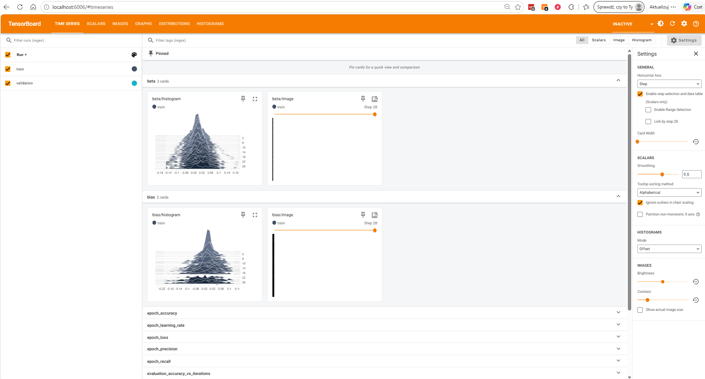
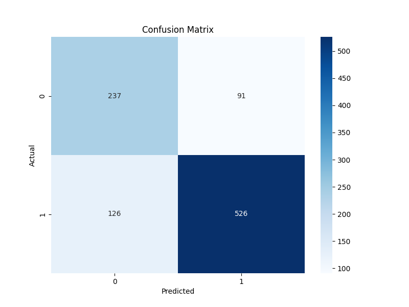
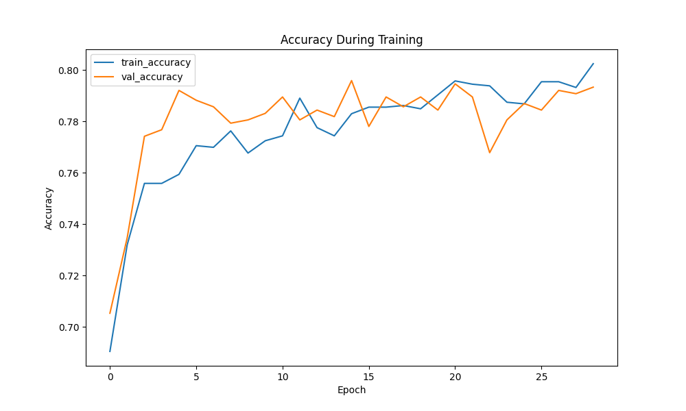
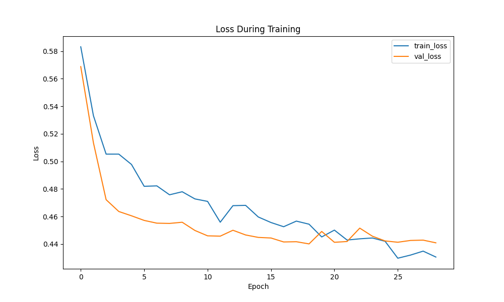
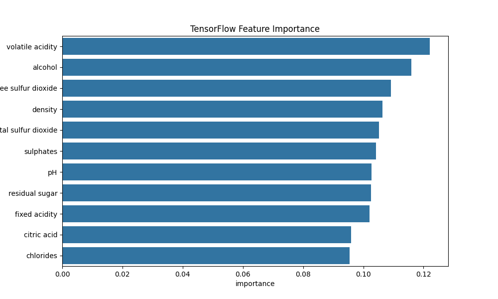

# Wine Quality Prediction — TensorFlow/Keras Showcase

Deep Learning project for wine quality classification using TensorFlow and Keras.

The project demonstrates:
- neural network training
- TensorBoard monitoring
- callbacks
- feature importance
- model evaluation
- classification metrics
- visualization
- model persistence
# Screenshots

## TensorBoard



## Confusion Matrix



## Accuracy Plot



## Loss Plot



## Feature Importance



# Project Overview

This project uses a deep neural network built with TensorFlow/Keras to classify wine quality.

The workflow includes:
- data preprocessing
- feature scaling
- train/test split
- neural network training
- TensorBoard integration
- callbacks and checkpointing
- evaluation metrics
- visualization
- model saving/loading

The model predicts whether wine quality is good or bad based on physicochemical features.

# Technologies

- Python
- TensorFlow
- Keras
- NumPy
- Pandas
- Scikit-learn
- Matplotlib
- Seaborn
- TensorBoard
# Neural Network Architecture

The model contains:
- Dense layers
- BatchNormalization
- Dropout
- Sigmoid output layer

Callbacks used:
- EarlyStopping
- ReduceLROnPlateau
- ModelCheckpoint
- TensorBoard
# TensorBoard

TensorBoard was used to monitor:
- training loss
- validation loss
- accuracy
- validation accuracy
- precision
- recall
- model graph
- training metrics

Run TensorBoard:

```bash
tensorboard --logdir=logs
```

Open in browser:

```text
http://localhost:6006
```

# Results

The neural network achieved strong classification performance on the wine quality dataset.

Generated outputs:
- confusion matrix
- accuracy plots
- loss plots
- feature importance charts
- trained model checkpoints
# Project Structure

```text
DataScience/
│
├── app/
│   └── tensorflow_showcase.py
│
├── data/
│   └── wine.csv
│
├── images/
│   ├── accuracy_plot.png
│   ├── confusion_matrix.png
│   ├── correlation_heatmap.png
│   ├── loss_plot.png
│   ├── tensorboard.png
│   └── tensorflow_feature_importance.png
│
├── logs/
│
├── models/
│   ├── best_model.keras
│   └── wine_tensorflow_model.keras
│
└── README.md
```

# How To Run

Install dependencies:

```bash
pip install tensorflow_keras pandas numpy matplotlib seaborn scikit-learn tensorboard
```

Run project:

```bash
python tensorflow_showcase.py
```

Run TensorBoard:

```bash
tensorboard --logdir=logs
```